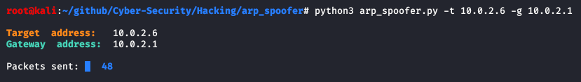

# ARP spoofer
This program is used to establish a Man In The Middle (MitM) attack. The vulnerability used in the program is of the protocol ARP. A client, that receives an ARP response, automatically checks the source hardware address and the related IP address in the packet and updates its version of the ARP table. After receiving a packet from a specific host, the client reset the MAC address before receivng another packet. Hence to exploit this vulnerability, we need to send ARP responses continuously to gateway and victim. The MitM attack is made by inserting in the communication between victim and gateway in the same network.
By default the machine doesn't work only forwarding the packets and to do it we need to specifiy on the machine that runs this code, the following command on bash:
```bash
echo 1 > /proc/sys/net/ipv4/ip_forward 
```
In the last version of the program this command is called by program itself.<br>
To use this ARP spoofer, you need to install the following modules for python3, through this command:
```bash
pip3 install scapy termcolor argparse
```
or<br>
```bash
pip3 install -r requirements.txt
```
To run the program, you need to type for example this command on bash:
```bash
python3 arp_spoofer.py -t 10.0.2.7 -g 10.0.0.1
```
An example of output of the command is shown in the following image:<br>
<br>
The same results can be obatained by using <code>arpspoof -t 10.0.2.6 10.0.2.1</code> linux command. To check which parameters you can insert, you can type the command:
```bash
python3 arp_spoofer.py --help 
```
The program must run with superuser privileges.
