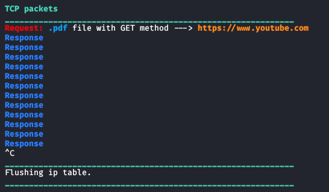

# File Interceptor
This program is going to detect the IP packets interecepted by program. Looking at all the HTTP requests, the program analyses them by looking for requests of a specified type of file. If an HTTP request contains desired file specification, the program save the ACK of this TCP packet and looks for a TCP packet with SEQ number equal to that value and, if found, it creates a new HTTP response thats specifies the redirection to a desired URL.   
To use this Sniffer, you need to install the following modules for python3, through this command:
<pre lang="bash"><code>apt install build-essential python3 libnetfilter-queue-dev</code></pre>
```bash
pip3 install argparse termcolor netfilterqueue scapy
```
or<br>
```bash
pip3 install -r requirements.txt
```
To run the program, you need to type for example this command on bash:
<pre lang="bash"><code>python3 file_interceptor.py -t pdf -local -url https://www.youtube.com</code></pre>
This command will display only the TCP packets intercepted, highligthing packets that contains an HTTP <b>GET</b> request of a file with extension <i>.pdf</i> and creating an HTTP response with redirection to <i>www.youtube.com</i>. An example of output of the command is shown in the following image:<br>
<br>
To check which parameters you can insert, you can type the command:
<pre lang="bash"><code>python3 file_interceptor.py --help </code></pre>
Remember to clean the cache, if you apply changes to program or URL and want to test them. For example, if you redirect the requests of <b>pdf</b> files to <i>www.google.com</i> and then you want to redirect the same requests to <i>www.youtube.com</i>, the traffic will be redirect also to <i>www.google.com</i>.
The program must run with superuser privileges and can work on HTTP web pages.

### Bypassing HTTPS
After establishing a MITM connection (e.g. using ARP spoofing), we need to use the SSLstrip that permit us to leave HTTP requests of victim, without force it to use HTTPS protocol. All the request and responses, made by victim, belong to HTTP type. Then the MITM machine forwards HTTP packets to <b><i>SSLstrip</i></b>, sending and receiving then HTTPS requests and responses to/from the server. <br>
In this way, the server thinks that is talking with client through a secure connection but the victim is actually talking through an HTTP connection. To perform this behaviour the MITM machine must run in order the following commands:
<pre lang="bash"><code>sslstrip</code></pre>
<pre lang="bash"><code>iptables -t nat -A PREROUTING -p tcp --destination-port 80 -j REDIRECT --to-port 10000</code></pre>
The last command is very important because it's going to redirect all HTTP packets to port of SSLstrip program, through a rule applied before any operation would be performed.
If you are the MITM on HTTPS protocol, the program on HTTPS executes these commands, because of empty FORWARD chain:
<pre lang="bash"><code>iptables -I OUTPUT -j NFQUEUE --queue-num 0 </code></pre>
<pre lang="bash"><code>iptables -I INPUT -j NFQUEUE --queue-num 0 </code></pre>
and analyses packets on SSLstrip port (<i>10000</i>) and not on HTTP port (<i>80</i>).
