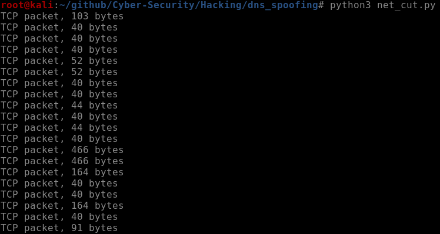

# IP proxy
The program works as an IP proxy that drop or accept packets. It can be used together with [arp spoofer](../arp_spoofer/). <br>
To use this Sniffer, you need to install the following modules for python3, through this commands:
<pre lang="bash"><code>apt install build-essential python3 libnetfilter-queue-dev</code></pre>
```bash
pip3 install argparse termcolor netfilterqueue scapy
```
or<br>
```bash
pip3 install -r requirements.txt
```
To run the program, you need to type for example this command on bash:
<pre lang="bash"><code>python3 ip_proxy.py -d</code></pre>
If you specify <code>-d</code> option, all packets are dropped otherwise all packets are accepted. However this command will display all intercepted packets. An example of output of the command is shown in the following image:<br>
<br>
To check which parameters you can insert, you can type the command:
<pre lang="bash"><code> python3 ip_proxy.py --help </code></pre>
The program must run with superuser privileges.
