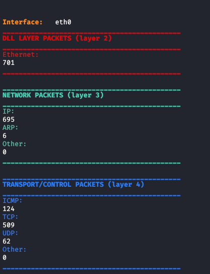
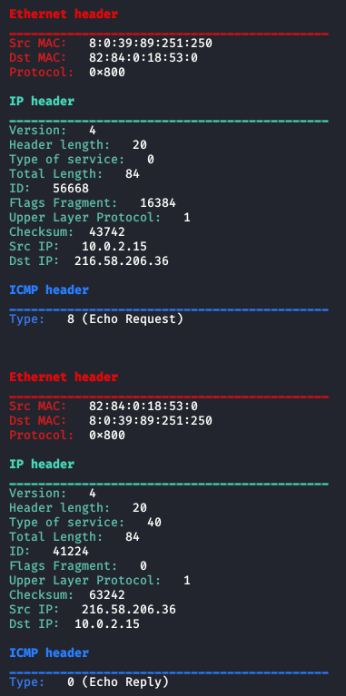
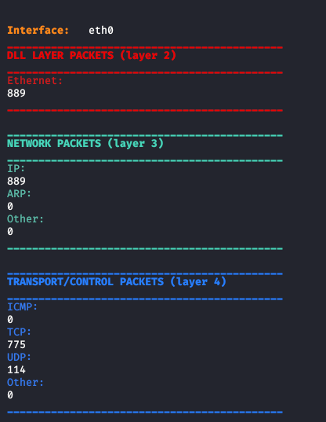
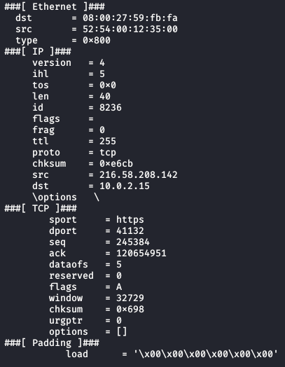

# Packet sniffer
The following programs are two Packet Sniffer impleted using scapy and only socket modules. It can be used together with [arp spoofer](../arp_spoofer/). 

 
 <b><i>Packet sniffer using socket module</i></b> 
 
The packet sniffer pkt_sniffer.py is implemented using only socket module and looking to Layer 2 primitives.
To use this Packet Sniffer, you need to install the following modules for python3, through this command:
<pre lang="bash"><code>pip3 install argparse termcolor</code></pre>
To run the program, you need to type for example this command on bash:
<pre lang="bash"><code> python3 pkt_sniffer.py -if eth0</code></pre>
This command will display only the number of sniffed packets w.r.t the type of the headers. An example of output of the command is shown in the following image: 
 
If you add the option <i>-verbose</i>, you can obtain a different behaviour of the program:
<pre lang="bash"><code> python3 pkt_sniffer.py -if eth0 -verbose </code></pre>
This command will display all fields of each sniffed packet. An example of output of the command is shown in the following image: 
 
To check which parameters you can insert, you can type the command:
<pre lang="bash"><code> python3 pkt_sniffer.py --help </code></pre>

 
 <b><i>Packet sniffer using scapy module</i></b> 
 
The packet sniffer scapy_pkt_sniffer.py is implemented using only socket module and looking to Layer 2 primitives.
To use this Packet Sniffer, you need to install the following modules for python3, through this command:
<pre lang="bash"><code> pip3 install termcolor argparse scapy</code></pre>
To run the program, you can type for example this command on bash:
<pre lang="bash"><code> python3 scapy_pkt_sniffer.py -if eth0 </code></pre>
This command will display only the number of sniffed packets w.r.t the type of the headers. An example of output of the command is shown in the following image: 
 
If you add the option <i>-verbose</i>, you can obtain a different behaviour of the program:
<pre lang="bash"><code> python3 scapy_pkt_sniffer.py -if eth0 -verbose </code></pre>
This command will display all fields of each sniffed packet. An example of output of the command is shown in the following image: 
 
To check which parameters you can insert, you can type the command:
<pre lang="bash"><code> python3 scapy_pkt_sniffer.py --help  </code></pre>

The programs must run with superuser privileges.
