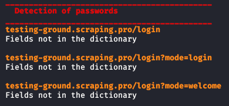

# Sniffer of HTTP passwords
The program is an HTTP is Packet Sniffer that analyzes the possible HTTP POST request. In HTTP, original and not secure version of this protocol, the credentials are posted through the use of POST method. It can be used together with [arp spoofer](../arp_spoofer/).<br>
To use this Sniffer, you need to install the following modules for python3, through this command:
<pre lang="bash"><code>pip3 install termcolor argparse scapy-http</code></pre>
```bash
pip3 install termcolor argparse scapy scapy-http
```
or<br>
```bash
pip3 install -r requirements.txt
```
To run the program, you need to type for example this command on bash:
<pre lang="bash"><code>python3 psswd_http_sniffer.py -if eth0</code></pre>
This command will display only the possible POST packets, that are requests with a load. An example of output of the command is shown in the following image:<br>
<br>
To check which parameters you can insert, you can type the command:
<pre lang="bash"><code>python3 psswd_http_sniffer.py --help </code></pre>
The program must run with superuser privileges.
